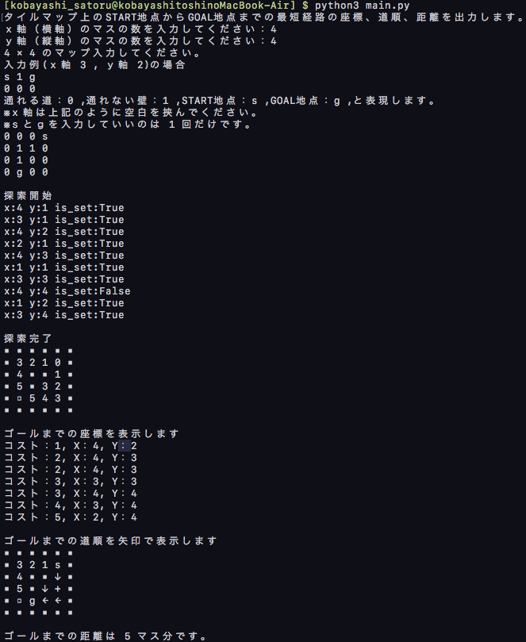

dijkstra_maze_python
====
ダイクストラ法を用いて最短経路の道順、座標、距離を出力するメソッドです。  
START地点とGOAL地点を指定された二重リスト構造で表現されたタイルマップに使用できます。  

## Requirement
python3 がインストールされている必要があります。
## Usage
「dijkstra_maze_python」のディレクトリ下で以下のコマンドを実行するだけです。  
`$ python3 main.py`
